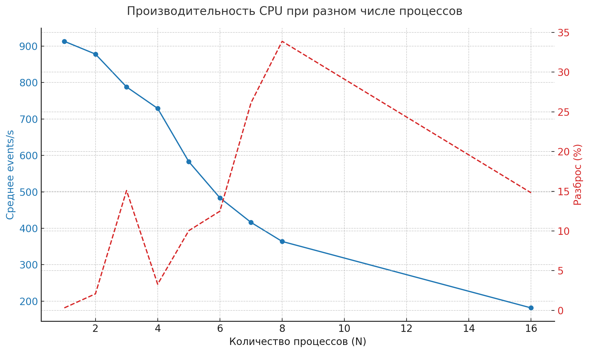
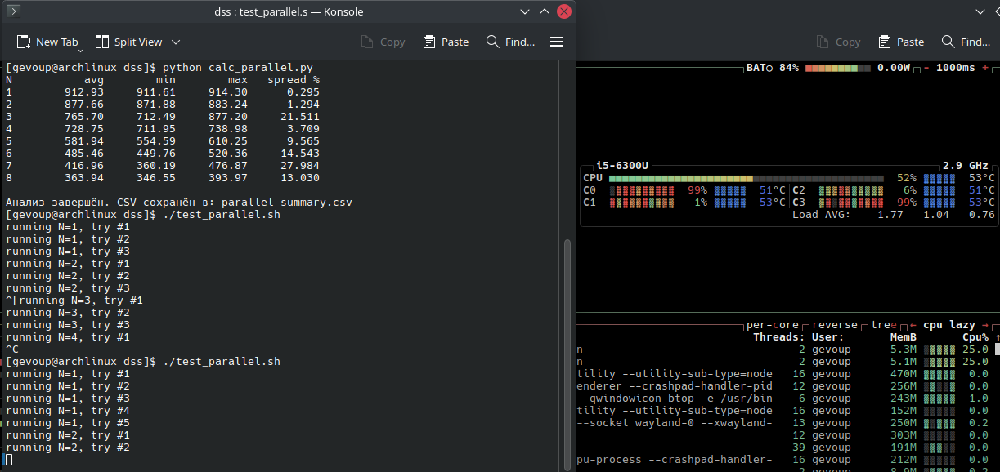

# Тестовое задание в DSS

## Задача

В тестовом задании требовалось произвести исследование одной из подсистем компьютера: зависимость производительности от различных параметров. Для исследования был выбран процессор. Тестируемый процессор имеет 2 физических ядра и 4 виртуальных ядра (потока) соответственно.

## Выполнение

Для того, чтобы определить оптимальное T, запустим проверку производительности с различными значениями T, каждый по 5 раз, с помощью первого скрипта `test_time.sh`. Были получены следующие результаты:

| T   | avg    | min    | max    | spread % |
| --- | ------ | ------ | ------ | -------- |
| T1  | 903.93 | 893.61 | 909.38 | 1.745    |
| T2  | 909.70 | 908.93 | 910.76 | 0.201    |
| T3  | 909.40 | 905.74 | 912.64 | 0.759    |
| T4  | 912.39 | 909.89 | 913.30 | 0.374    |
| T5  | 912.81 | 912.43 | 913.39 | 0.105    |
| T10 | 912.13 | 910.77 | 912.99 | 0.243    |
| T15 | 896.37 | 864.30 | 913.82 | 5.524    |
| T20 | 878.06 | 863.54 | 894.67 | 3.545    |
| T30 | 897.04 | 870.50 | 910.74 | 4.486    |
| T40 | 911.12 | 909.27 | 912.14 | 0.315    |
| T50 | 911.35 | 908.33 | 912.50 | 0.458    |
| T60 | 910.20 | 900.92 | 913.18 | 1.347    |

На основе данных результатов, можно предположить, что самое оптимальное значение T - 5 или 10, так как у них лучшие средние результаты производительности и наименьший разброс. Проведём отдельные тесты T=5 и T=10, запуская каждый тест по 10 раз:

| T   | avg    | min    | max    | spread % |
| --- | ------ | ------ | ------ | -------- |
| T5  | 909.22 | 905.25 | 914.74 | 1.044    |
| T10 | 911.62 | 910.51 | 912.47 | 0.215    |

Так, в данном случае, параметр T=10 даёт более устойчивый результат на большем отрезке времени с непрерывным запуском тестов, и незначительно лучший результат. Будем в дальнейшем использовать параметр T равный 10.

Напишем скрипт `test_parallel.sh`, который будет запускать определённое количество процессов по 5 раз, чтобы определить разброс результатов. Были получены следующие результаты:

| N   | avg    | min    | max    | spread % |
| --- | ------ | ------ | ------ | -------- |
| 1   | 912.97 | 911.77 | 914.68 | 0.319    |
| 2   | 877.92 | 869.39 | 887.70 | 2.086    |
| 3   | 787.83 | 747.96 | 866.88 | 15.095   |
| 4   | 728.87 | 719.52 | 743.56 | 3.298    |
| 5   | 582.86 | 551.02 | 609.52 | 10.037   |
| 6   | 483.61 | 460.37 | 520.78 | 12.492   |
| 7   | 416.22 | 362.39 | 471.17 | 26.135   |
| 8   | 363.95 | 325.69 | 449.00 | 33.881   |
| 16  | 181.68 | 170.43 | 197.34 | 14.812   |

По результатам можно заметить следующее: 
- Лучше всего тест производительности в среднем показывает себя при одном запущенном процессе, и далее результат проверки производительности идёт на убывание
- Тесты с 1, 2 и 4 запущенными процессами показывают низкий разброс, когда как тест с 3 процессами имеет аномально большой разброс, соизмеримый с разбросом в тестах при количестве процессов, больших чем количество потоков процессора. Это будет рассмотрено далее
- Тесты с количеством процессов, больших, чем количество потоков процессора, дают большой разброс (>10%)

Так же, по результатам выполнения был сделан график:

На графике видно аномальнго большой разброс при 3 процессах, и то, как убывает производительность при увеличеснии запущенных процессов

Как было замечено ранее, тест с 3 процессами давал большой разброс. Моё предположение состоит в том, что это связано с тем, как работает система SMT, при которой при наличии в процессоре 2-х логических ядер, работает 4 потока. Рассмотрим случаи с 1, 2, 3 и 4 процессами:
- 1 процесс - процессор нагружает тестом один из двух логических ядер, и в нём тест работает в одном из двух потоков. В данном случае проблем не имеется, и тест выдаёт самый лучший результат с наименьшим процентом выбросов.
- 2 процесса - процессор нагружает тестом каждое ядро, предоставляя каждому тесту один из двух потоков. В ходе выполнения многочисленных тестов, с помощью утилиты btop+ было замечено, что при запуске двух процессов, никогда не нагружается полностью только одно логическое ядро - обязательно каждый тест выполняется отдельным ядром, чтобы не возникало конкуренции за ресурсы одного ядра.

Как видно на скриншоте, при выполнении теста с двумя процессами заняты виртуальные ядра C0 и C3, что соответствует заполнению двух ядер двумя процессами.
- 3 процесса - так как обработкой должны быть заняты 3 потока, в одном ядре занят один поток, а во втором ядре всегда заняты оба потока, и тем самым происходит конкуренция за ресурсы одного ядра. В связи с этим, лучшая производительность в данном случае соизмерима с худшей производительностью случая с двумя процессами, а худшая - с лучшей производительностью случая с 4 процессами.
- 4 процесса - нагружены все ядра и все потоки, и все процессы находятся в одинаково не лучших условиях конкуренции за мощности своего ядра, поэтому результат стабильный, но ограниченный разделённой мощностью ядра.

Случаи с количеством процессов >4 работают как случай с 4 процессами, однако внутри каждого потока происходит процесс планирование задач, по которому задачи выполняются друг за другом по определённому алгоритму, из-за чего общая производительность падает с увеличением количества процессов. Стоит отметить, во время тестирования с любым количеством процессов, потоки и так нагружены другими процессами, работающими во время тестирования, поэтому система даже в случае с 1 процессом проводит планирование процессов, и из-за этого результат может разниться.
